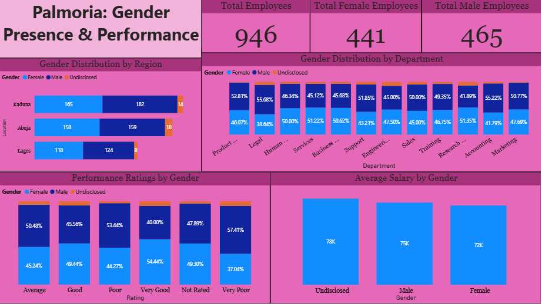
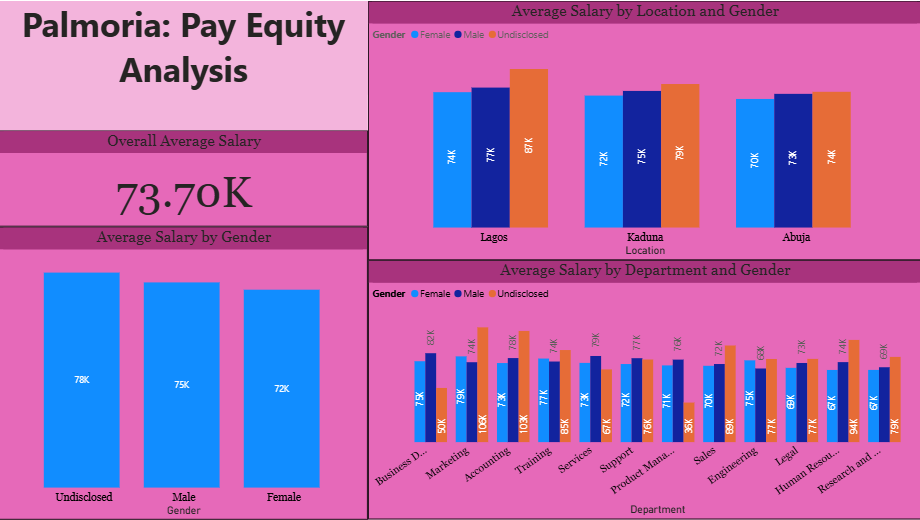
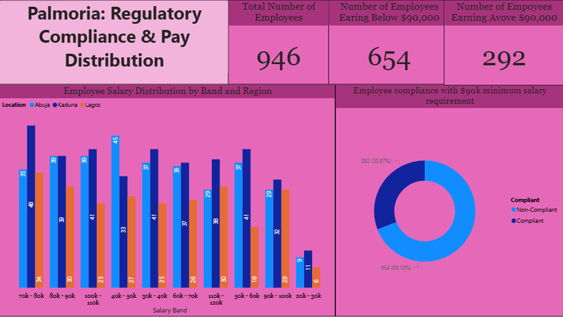
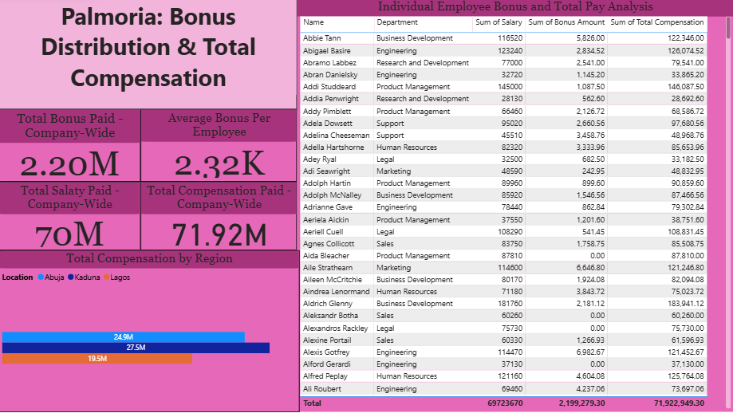

# Palmoria-Group-HR-Analysis
This project analyzed gender inequality issues for **Palmoria Group**  using Microsoft Power BI. The report explores gender-related patterns in employee distribution, performance ratings, and salary structure. It also includes a compliance check with the newly adopted salary regulation and with a breakdown of bonus payouts by region.These findings help support data-driven decision-making and promote fairness across the organization.

## Objective
To explore and visualize key HR metrics related to:
- Gender distribution across departments and regions
- Performance ratings by gender
- Salary structures and potential gender pay gaps
- Regulatory compliance with salary standards
- Bonus allocation based on performance

## TOOLS USED
- Microsoft Power BI 
- Power query 
- Dashboard Charts

## Case Questions and Insights

### Q1: What is the gender distribution in the organization? Distil to regions and departments.
- **Answer**: The gender distribution across the 946 employees shows a slight difference between males and females. With the value of 465 employees for male, 441 employees for female and 40 employees undisclosed. Also some departments like Legal, Accounting have more male representation.

### Q2: Show insights on ratings based on gender.
- **Answer**: Ratings are fairly distributed across genders, but a higher number of females received "Very Good" and "Good" ratings, while males had a higher percentage in the "Very Poor", "Poor", and "Average" categories.

### Q3: Is there a gender pay gap? Which departments or regions are affected?
- **Answer**: The undisclosed groups have the highest average salary, followed by males, then females. Also, males generally earn more than females across departments except for Marketing, Training, and Engineering which females earn more than male. There is a pay gap in each region and it is a higher a bit in Lagos.

### Q4: Does Palmoria meet the $90,000 minimum salary regulation?
- **Answer**: No. Only 292 out of 946 employees earn $90,000 or more. The majority (654 employees) are non-compliant.

- **Bonus Insight**: Salary bands reveal that most employees earn between $70,000–$80,000. Kaduna has the highest concentration of high earners (Employees earning $90,000 and above).

### Q5: Bonus and Total Compensation
- **Answer**: Bonuses were allocated based on performance ratings. Total compensation (salary + bonus) was calculated for each employee.
   - **Total Bonus Paid (Company-wide)**: $71,922,000
   - **Bonus by Region**:  
     - **Lagos**: $19,500,000
     - **Kaduna**: $27,500,00
     - **Abuja**: $24,900,000

## Dashboard Structure

The report is structured into **four dashboard pages**:

### **1. Palmoria: Gender Presence & Performance**
- Gender distribution by region and department
- Performance ratings breakdown by gender
- Total number of employees
- Average salary by gender

### **2. Palmoria: Pay Equity Analysis**
- Salary comparison by gender across departments
- Salary by gender and location
- Average salary by gender
- Overall average salary

### **3. Palmoria: Regulatory Compliance & Pay Distribution**
- Number of employees earning below $90,000
- Pay band distribution by region
- Compliance rate with new salary regulations

### **4. Palmoria: Bonus Distribution & Total Compensation** 
- Bonus allocation per employee (based on rating)
- Total compensation (salary + bonus)
- Bonus payout by region and company-wide

- # Key Insights
- Over **69%** of Palmoria employees earn below the required **$90,000** minimum salary.
- Gender distribution varies slightly across departments, with some areas showing imbalance.
- Males tend to have higher average salaries in key departments, which indicate a gender pay gap.
- The average salary across the company is **$73.7K**.

## Palmoria-Group-HR-Analysis Dashboards
###  Palmoria: Gender Presence & Performance Dashboard

###  Palmoria: Pay Equity Analysis Dashboard

###  Palmoria: Regulatory Compliance & Pay Distribution Dashboard

###  Palmoria: Bonus Distribution & Total Compensation Dashboard

